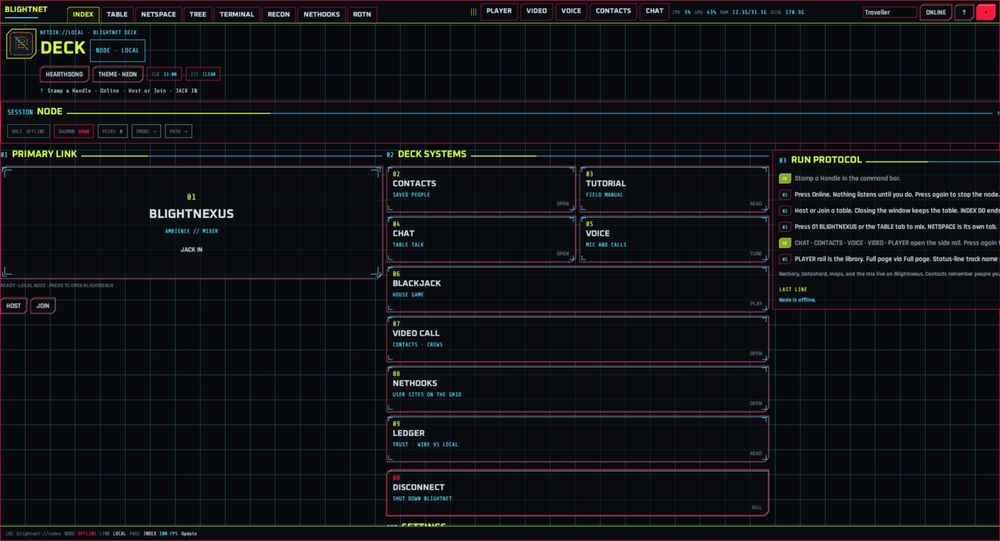
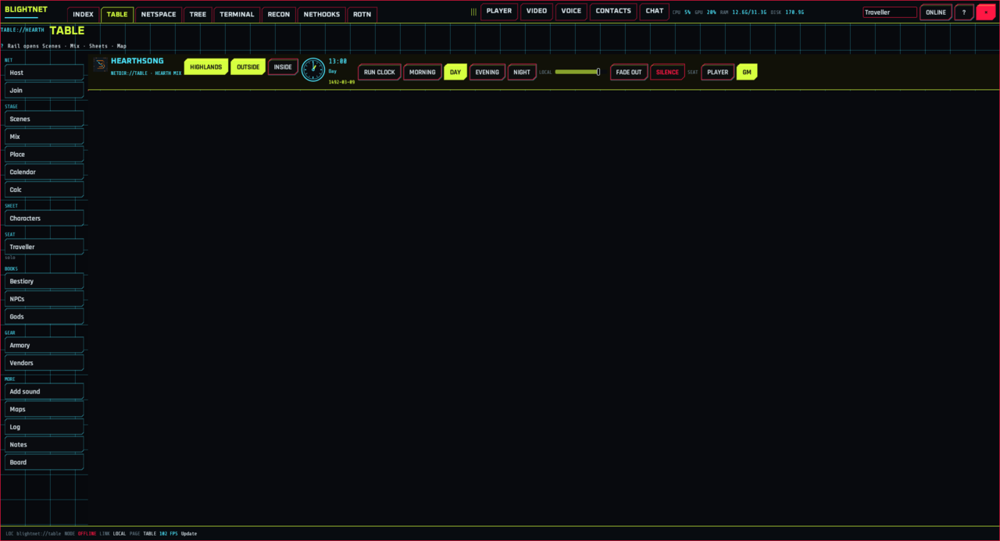
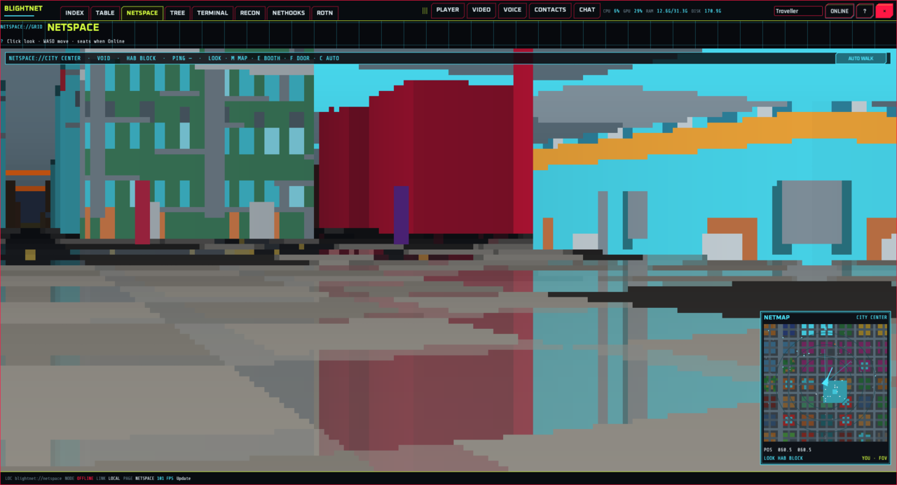
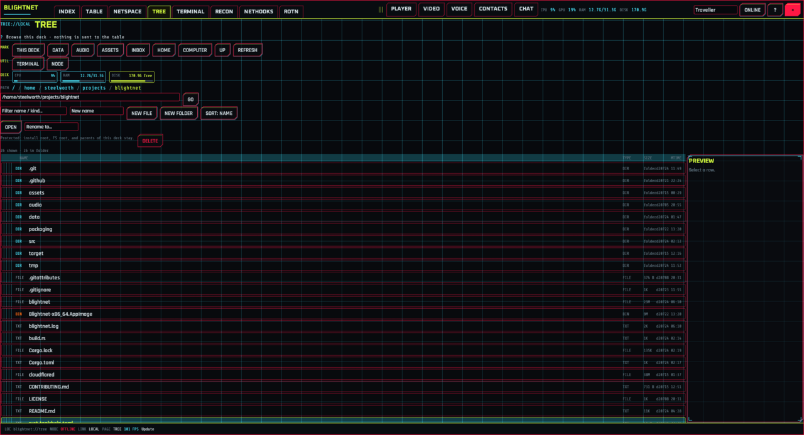
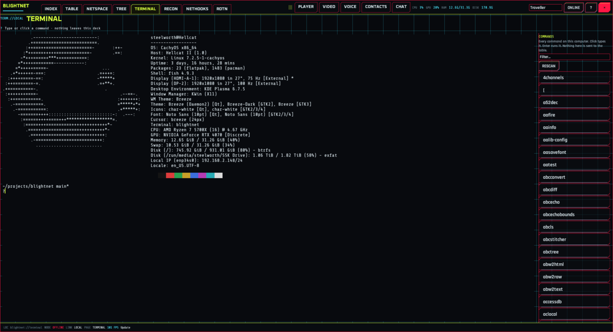
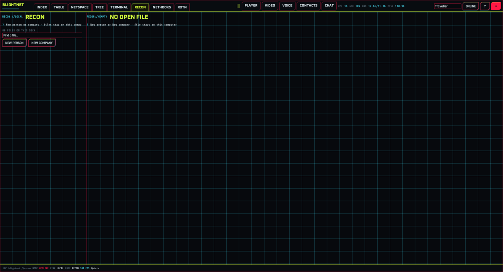
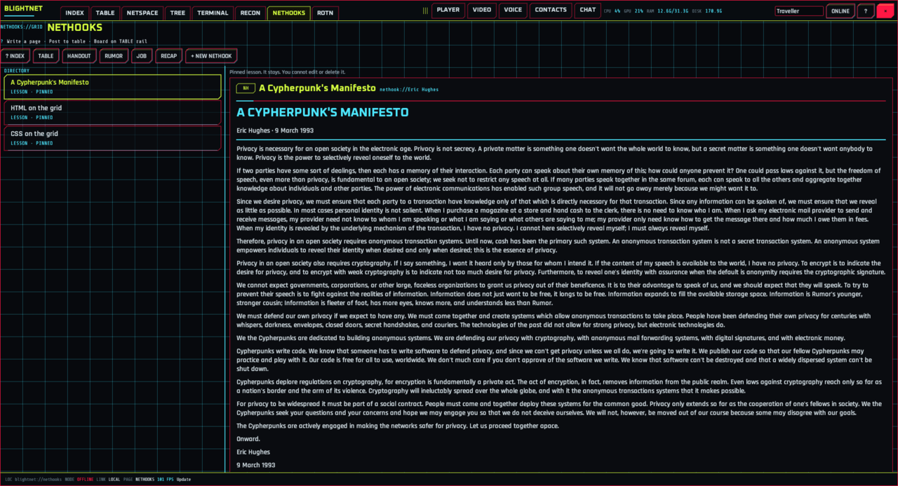
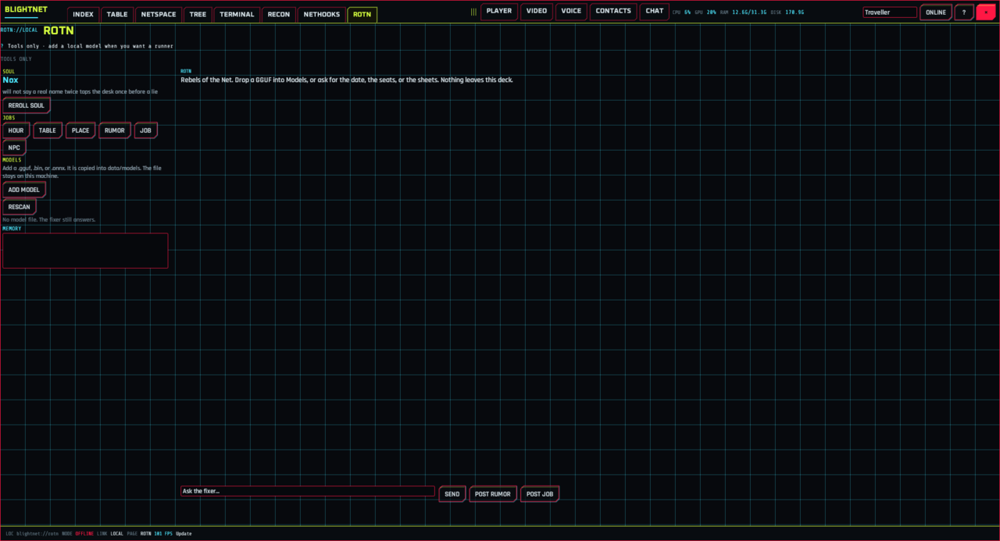

# Blightnet

A **local** table for D&D 5e and Cyberpunk RED. Mix music and weather, drop maps, run character sheets, buy and sell, and host friends — same house or another city.

Blightnet is a **native program** (Rust). It does **not** use a web browser. Keep the whole folder together so `audio/`, `assets/`, and `data/` sit next to the binary.

The download is large (~1.2 GB) because the music, ambience, and art ship with the app.

Repo: [github.com/Steelworth/Blightnet](https://github.com/Steelworth/Blightnet)

---

## Screenshots

### INDEX


Front desk: stamp a Handle, go Online, Host or Join, and open deck tiles.

### TABLE


Session table: scenes, mix, maps, sheets, and the side tools.

### NETSPACE


Walkable city on its own tab (WASD, look, map).

### TREE


Folders on this computer. Nothing here is sent to the table.

### TERMINAL


Local shell. Text stays on this machine.

### RECON


Local case desk for people and companies.

### NETHOOKS


Pages you write; post to the table board when you want.

### ROTN


Local fixer. Talks only to a model on this computer.

---

## Download for the first time

Pick **one** method. Keep the whole folder together (`start.sh` / `start.bat`, `audio`, `assets`, `data`). Do not scatter those files.

### 1. Download ZIP (no Git)

1. Open **[github.com/Steelworth/Blightnet](https://github.com/Steelworth/Blightnet)**.
2. Click the green **Code** button → **Download ZIP**.
3. Unzip it. You should get a folder named **`Blightnet-main`**.
4. Follow **Windows**, **Linux**, or **macOS** below.

Later, open Blightnet and press **Update** on INDEX or on the status line. That pulls new or changed files from GitHub. Restart after it finishes.

### 2. Git clone (if you already use Git)

```bash
git clone https://github.com/Steelworth/Blightnet.git
cd Blightnet
```

Then follow **Windows**, **Linux**, or **macOS** below. **Update** on INDEX or the status line can fast-forward this clone. Restart after it finishes.

---

### Windows

You need [Rust](https://rustup.rs) once, so `start.bat` can build the native window (or use a prebuilt `target\release\blightnet.exe`).

1. Open the unzipped **`Blightnet-main`** folder.
2. Double-click **`start.bat`**. The first run compiles; later runs just launch.
3. A **Blightnet** window opens. There is no browser and no `http://127.0.0.1`.

Closing the window does not stop the node. Press **Online** again to take it offline and leave the window open. INDEX **00 DISCONNECT** stops the node and closes the window. `blightnet daemon-stop` stops the node from a terminal. You do not need the `tools` folder on Windows.

If Windows SmartScreen warns about an unknown app: **More info** → **Run anyway**. That is the local launcher, not a Store download.

If Windows Firewall asks, allow **Blightnet** on a private network for TCP and UDP **8766** so friends can Join.

Video call and screen share on Windows need [FFmpeg](https://ffmpeg.org) on PATH (camera uses DirectShow, screen uses gdigrab). Live compressed voice needs system **libopus** on the link path (same as Linux). Mic, speakers, chat, maps, and Host/Join work without FFmpeg. Screenshare is **LAN-good / WAN best-effort** (JPEG frames over the table wire).

### Linux

You need **Rust** (`rustc` / `cargo`) for the first build. Then:

```bash
cd Blightnet-main    # or: cd Blightnet
chmod +x start.sh
./start.sh
```

That runs the native window. Install Rust from [rustup.rs](https://rustup.rs) if `cargo` is missing.

#### Live calls (Linux)

- **Voice** needs system **libopus** (`libopus` / `libopus-dev`) to build and run compressed call audio.
- **Echo cancel** is optional: install **speexdsp** / `libspeexdsp` (pkg-config name `speexdsp`). The build probes at compile time; without it Blightnet still builds and voice still runs.

#### Video call and screen share (Linux)

- **Camera** needs [FFmpeg](https://ffmpeg.org) on PATH (V4L2).
- **Screen share on Wayland** prefers **xdg-desktop-portal** + **PipeWire**:
  - Portal: `xdg-desktop-portal` plus a desktop backend (`xdg-desktop-portal-kde`, `-gnome`, or `-wlr`).
  - Capture: GStreamer `pipewiresrc` (`gst-plugin-pipewire` / `gstreamer` tools) plus either `jpegenc` from **gst-plugins-good** or `avenc_mjpeg` from **gst-libav**; alternatively use an FFmpeg build with `-f pipewire`.
  - First share: click **Share** / **Allow** in the system portal dialog (monitor or window).
- **X11** (or XWayland fallback) uses FFmpeg `x11grab` when PipeWire portal tools are missing — on pure Wayland that path is often blank for native windows.
- Screenshare is **one GM share**, **LAN-good / WAN best-effort**. If camera or screen capture dies mid-call, **voice stays up**.
- Mic, speakers, chat, maps, and Host/Join work without FFmpeg or portal packages. Compressed live voice still needs **libopus**.

To build a double-click launcher after the release binary exists:

```bash
chmod +x packaging/build-appimage.sh
./packaging/build-appimage.sh
```

That writes `Blightnet-x86_64.AppImage` in this folder. Keep `audio/`, `assets/`, and `data/` beside the image, then double-click it. If FUSE is missing: `APPIMAGE_EXTRACT_AND_RUN=1 ./Blightnet-x86_64.AppImage`.

#### Steam Deck

1. Copy the AppImage plus `audio/`, `assets/`, and `data/` into one folder (Desktop or an SD card folder).
2. In Desktop Mode: `chmod +x Blightnet-x86_64.AppImage`, then run with `APPIMAGE_EXTRACT_AND_RUN=1 ./Blightnet-x86_64.AppImage` if FUSE is missing.
3. Press **Online**, then **Host** or **Join** on the same Deck to verify the local node. Check the node with `./Blightnet-x86_64.AppImage daemon-status` (or `blightnet daemon-status` from a build).
4. Game Mode / gamescope is **untested** — use Desktop Mode for now.

### macOS

You need **Rust** (`cargo`) for the first build.

1. Open **Terminal**.
2. `cd` into the unzipped folder.
3. Run:

```bash
chmod +x start.sh
./start.sh
```

If macOS blocks the binary: System Settings → Privacy & Security → **Open Anyway**. Install Rust from [rustup.rs](https://rustup.rs) if `cargo` is missing.

Video call and screen share need [FFmpeg](https://ffmpeg.org) on PATH. Live compressed voice needs system **libopus**. Mic, speakers, chat, maps, and Host/Join work without FFmpeg.

---

## After it is running

The command bar is the top row. Tabs are **INDEX**, **TABLE**, **NETSPACE**, **TREE**, **TERMINAL**, **RECON**, **NETHOOKS**, and **ROTN**. **CHAT**, **CONTACTS**, **VOICE**, **VIDEO**, and **PLAYER** stay pinned on that row. **Online** starts the node. Press it again to stop the node and leave the window open. CPU, GPU (or a dash), RAM, and free disk stay on the bar. Those numbers are not sent to anyone.

INDEX:

- **01 BLIGHTNEXUS** opens TABLE.
- **02 CONTACTS**, **04 CHAT**, **05 VOICE**, and **07 VIDEO CALL** open the side rail.
- **03 TUTORIAL** is the field manual.
- **06 BLACKJACK** opens House 21 on the table.
- **08 NETHOOKS** opens the page desk.
- **Update** pulls from GitHub. **Rescan devices** looks for mics, speakers, and cameras.
- **00 DISCONNECT** shuts the node down and closes the window.

Set a **Handle** in the command bar. Switch **Hearthsong** / **Blight** on INDEX or on the TABLE bar. Catalogs open from the table’s left rail.

---

## What you get

**Hearthsong** (fantasy) — tavern gold, sheets, bestiary, NPCs, gods, Armory, market stalls.

**Blight** — HUD chrome, sheets, Datashard, Faces, Corps, Lore, Gangs, Night Market, radio, blackjack, and chess.

Both worlds:

- Mixer. Scenes and mix open as tiles in the center. Master volume stays on this computer. Time of day and the place painting sync.
- Catalogs, character sheets, and the percentage die.
- House 21. On Blight, chess sits beside it. The host plays white.
- **NETSPACE**, a walkable city on its own tab. WASD, mouse look, Shift to run, C to cruise.
- **PLAYER** for pictures, video, PDF, and music on this computer. It does not change the table mix. Stop ends a station.
- **RECON**, a local file of people and companies. It never leaves this computer.
- **ROTN**, a local fixer. It only talks to a model you start on this machine.
- **TERMINAL**, a local shell. Its text is not sent to the table.
- Nethooks you can post to the table board. Private notes stay local.

Chat, the mix, sheets, map tokens, fog, and a posted nethook sync between seats. Invites look like `blightnet://`. There is no tunnel program. If friends cannot join across the internet, forward TCP and UDP **8766** on the host. Host path health reports UPnP TCP/UDP and STUN/public IP as **best-effort reachability only** — a mapped port is not a trust boundary, and UPnP leases can be finite or denied by the router.

---

## First click

1. Wait for the wake, or click / press a key to skip it.
2. Set a **Handle**. Switch Hearthsong or Blight.
3. Press **Online**. Nothing listens until you do.
4. **Host** or **Join** from INDEX or from the table’s left rail. Copy the `blightnet://` invite for friends.
5. Open **TABLE**. Pick a scene. Sound loops until **Silence**.

**Master** is local. **Place** and the time of day change the painting. INDEX returns to the deck without stopping the mix. Closing the window is not the same as **00 DISCONNECT**: the window X leaves the node running.

---

## If something is wrong

| What you see | What to do |
| --- | --- |
| No window | Install Rust from rustup.rs, then `./start.sh` or `start.bat`. |
| Missing catalog / no sound | Keep `data/`, `audio/`, and `assets/` next to the binary or the AppImage. |
| Node still running after you close the window | That is the window X. Press **Online** again, or run `blightnet daemon-stop`. **00 DISCONNECT** stops the node and closes. |
| Wrong painting after Blight | Switch world on the TABLE bar. Place resets to that world’s first location. |
| Friends cannot join | Both seats need this build. Paste the full `blightnet://` invite. Across the internet, forward TCP and UDP 8766 on the host. Host status lists UPnP/public IP/udp mesh as reachability hints only. |
| Deck AppImage node fails | Keep data beside the image. Use `APPIMAGE_EXTRACT_AND_RUN=1`. The UI embeds the node if spawn from the mount path fails. Run `daemon-status` to check. |
| Cargo errors | `cargo build --release` from the folder that contains `Cargo.toml`. |
| Wayland screen share asks for permission | Click **Share** / **Allow** in the portal dialog. Needs `xdg-desktop-portal` + kde/gnome/wlr backend, GStreamer `pipewiresrc`, and either **gst-plugins-good** (`jpegenc`) or **gst-libav** (`avenc_mjpeg`) (or FFmpeg `-f pipewire`). |
| Screen share black on Wayland | x11grab fallback cannot see most Wayland windows — install the portal + PipeWire path above. Voice stays if video fails. |
| Cargo cannot find Opus / voice encode fails | Install system **libopus** (and headers). Optional **speexdsp** for echo cancel; missing SpeexDSP still builds. |

---

## Development

The native app is **Rust** (`src/`, `Cargo.toml`). It reads the same `audio/`, `assets/`, and `data/` trees. Mixer catalogs are `data/mixer-catalog.json`.

```bash
cargo test --offline
cargo build --release
./packaging/build-appimage.sh
```

See [CONTRIBUTING.md](CONTRIBUTING.md).

---

## License

- **Code** — [MIT](LICENSE)
- **Bundled music and SFX** — keep their own licenses; see [THIRD_PARTY.md](THIRD_PARTY.md)

Kevin MacLeod (incompetech.com), CC BY 4.0 — credit him if you share a recording of a session.
